Kuhlanapo Gage Data Figures for Reports
================
Skyler Lewis
2026-07-17

- [0.1 Import Data](#01-import-data)
- [0.2 Groundwater Study](#02-groundwater-study)
- [0.3 Surface Water](#03-surface-water)
- [0.4 Specific Figures](#04-specific-figures)
- [0.5 SW-GW Interaction](#05-sw-gw-interaction)

``` r
knitr::opts_chunk$set(
    fig.height = 4,
    fig.width = 6.5,
    message = FALSE,
    warning = TRUE,
    dpi = 300
)
library(tidyverse)
```

    ## Warning: package 'ggplot2' was built under R version 4.4.3

    ## ── Attaching core tidyverse packages ──────────────────────── tidyverse 2.0.0 ──
    ## ✔ dplyr     1.1.4     ✔ readr     2.1.5
    ## ✔ forcats   1.0.0     ✔ stringr   1.5.1
    ## ✔ ggplot2   4.0.1     ✔ tibble    3.2.1
    ## ✔ lubridate 1.9.3     ✔ tidyr     1.3.1
    ## ✔ purrr     1.0.2     
    ## ── Conflicts ────────────────────────────────────────── tidyverse_conflicts() ──
    ## ✖ dplyr::filter() masks stats::filter()
    ## ✖ dplyr::lag()    masks stats::lag()
    ## ℹ Use the conflicted package (<http://conflicted.r-lib.org/>) to force all conflicts to become errors

``` r
library(janitor)
```

    ## 
    ## Attaching package: 'janitor'
    ## 
    ## The following objects are masked from 'package:stats':
    ## 
    ##     chisq.test, fisher.test

``` r
library(patchwork)
```

    ## Warning: package 'patchwork' was built under R version 4.4.3

``` r
theme_custom <- function(base_size = 12) {
  theme_minimal(base_size = base_size) +
    theme(
      panel.grid.major = element_blank(),
      panel.grid.minor = element_blank(),
      axis.line = element_line(color = "black", linewidth = 0.3),
      axis.ticks = element_line(color = "black", linewidth = 0.3),
      axis.title = element_text(size = rel(0.9)),
      plot.title.position = "plot"
    )
}
theme_set(theme_custom())

source(here::here("global.R"))

# As published on USGS lake level gage 11450000
navd88_to_rumsey_usgs <- function(x) x - 1320.74
rumsey_to_navd88_usgs <- function(x) x + 1320.74
```

## 0.1 Import Data

Import time series data

``` r
# pull the latest refreshed data from the dedicated `data` branch rather than
# this branch's local (static, increasingly stale) snapshots
data_branch_url <- "https://github.com/flowwest/kuhlanapo-gage-dashboard/raw/data/data"

download_rds <- function(name) {
  tmp <- tempfile(fileext = ".rds")
  download.file(paste0(data_branch_url, "/", name), tmp, mode = "wb", quiet = TRUE)
  readRDS(tmp)
}

ts_data <- download_rds("gage_data.rds")
ll_data <- download_rds("usgs_lake_level_11450000.rds")
precip_data <- download_rds("precip_ts.rds")
```

Apply data cleaning, exactly duplicating the procedure in `app.R`

``` r
df_pivot <- ts_data |>
      inner_join(sites |> select(code, category)) |>
      filter(parm_name %in% c("Depth", "Temperature")) |>
      mutate(parm_name_modified = case_when(
        parm_name == "Temperature" & type == "vulink" ~ "Air Temperature",
        parm_name == "Temperature" ~ "Water Temperature",
        TRUE ~ parm_name
      )) |>
      # convert units. also, depth readings less than zero are invalid
      mutate(value = case_when(
        parm_name == "Depth" ~ if_else(value > 0, value / 0.3048, 0),
        parm_name == "Temperature" ~ value * 9 / 5 + 32
      )) |>
      select(category, code, site, timestamp, parm_name_modified, value) |>
      pivot_wider(names_from = parm_name_modified, values_from = value) |>
      clean_names() |>
      # if troll is freezing, depth reading is invalid
      group_by(category, code, site) |>
      mutate(depth = if_else((water_temperature > 32) & 
                               coalesce(lag(water_temperature) > 32, TRUE), 
                             depth, NA)) |>
      ungroup() |>
      # don't show troll temp if there is no water
      mutate(water_temperature = if_else(depth > 0, water_temperature, NA)) |>
      mutate(site = factor(site, levels = unique(sensors$site))) |>
      mutate(timestamp = with_tz(timestamp, "America/Los_Angeles")) |>
      #############
      # LAKE LEVELS
      left_join(ll_data |> select(timestamp, lake_level = value), by = join_by(timestamp)) |>
      ##############################
      # GAGE WATER SURFACE ELEVATION
      left_join(sites |> select(code, twg_elev), by=join_by(code)) |>
      mutate(wse_ft_navd88 = if_else(depth > 0, depth + twg_elev, NA)) |>
      #################################
      # GROUNDWATER DEPTH AND ELEVATION
      # correct piezometer for well depth and calculate piezometer GWE
      inner_join(sensors |> filter(type == "troll") |> select(code, name), by = join_by(code)) |>
      left_join(piezo_meta |> select(name, gse_ft_navd88, tdx_ft_navd88), by = join_by(name)) |>
      # smooth spikes of length one in groundwater depth, eliminate other spikes
      group_by(category, site) |>
      mutate(depth = if_else(category == "Piezometer",
                             case_when((timestamp == min(timestamp)) ~ lead(depth),
                                       (abs(depth - lag(depth)) > 3) & (abs(depth - lead(depth)) > 3) ~ (lag(depth) + lead(depth)) / 2,
                                       (depth > 18) ~ NA,
                                       TRUE ~ depth),
                             depth)) |>
      ungroup() |>
      # calculate groundwater elevation
      mutate(gwe_ft_navd88 = if_else(category == "Piezometer",
                                     tdx_ft_navd88 + depth,
                                     NA),
             gw_depth_ft = if_else(category == "Piezometer",
                                   gse_ft_navd88 - gwe_ft_navd88,
                                   NA)
             ) |>
      select(-name, -gse_ft_navd88, -tdx_ft_navd88)
```

## 0.2 Groundwater Study

``` r
GW_START <- ymd_hms("2025-12-05T00:00:00")
GW_END <- ymd_hms("2026-02-05T23:59:59")
```

``` r
plt_gw_elev <-
  df_pivot |>
  filter(category == "Piezometer") |>
  filter(timestamp >= GW_START) |>
  filter(timestamp <= GW_END) |>
  ggplot(aes(x = timestamp, y = gwe_ft_navd88)) +
  geom_line(data = ll_data |> filter(timestamp < GW_END), 
            aes(y = value, linetype = "Lake Level")) +
  geom_line(aes(color = code)) +
  geom_hline(aes(yintercept = rumsey_to_navd88_usgs(7.56),
                 linetype = "Full Lake")) +
  scale_x_datetime(name = "",
                   date_breaks = "1 week",
                   expand = c(0, 0),
                   limits = c(GW_START, GW_END)) +
  scale_y_continuous(name = "Elevation (ft NAVD88)",
                     breaks = scales::breaks_width(1),
                     sec.axis = sec_axis(name = "Elevation (ft Rumsey)", 
                                         transform = ~ navd88_to_rumsey_usgs(.),
                                         breaks = scales::breaks_width(1))) +
  scale_color_manual(name = "Piezometers",
                     values = piezo_colors) +
  scale_linetype_manual(name = "",
                        values = c("Lake Level" = "solid",
                                   "Full Lake" = "dotted")) +
  theme(panel.grid.major = element_line(),
        axis.text.x.bottom = element_text(angle = 30, hjust=1))

print(plt_gw_elev)
```

    ## Warning: Removed 73 rows containing missing values or values outside the scale range
    ## (`geom_line()`).

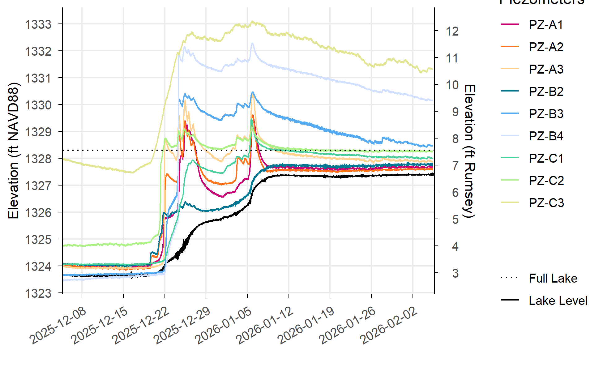<!-- -->

``` r
plt_gw_depth <-
  df_pivot |>
  filter(category == "Piezometer") |>
  filter(timestamp >= GW_START) |>
  filter(timestamp <= GW_END) |>
  ggplot(aes(x = timestamp, y = gw_depth_ft)) +
  geom_line(aes(color = code)) +
  geom_hline(aes(yintercept = 0,
                 linetype = "Ground")) +
  scale_x_datetime(name = "",
                   date_breaks = "1 week",
                   expand = c(0, 0),
                   limits = c(GW_START, GW_END)) +
  scale_y_reverse(name = "Depth Below Ground Surface (ft)",
                  breaks = scales::breaks_width(1)) +
  scale_color_manual(name = "Piezometers",
                     values = piezo_colors) +
  scale_linetype_manual(name = "",
                        values = c("Ground" = "dashed")) +
  theme(panel.grid.major = element_line(),
        axis.text.x.bottom = element_text(angle = 30, hjust=1))

print(plt_gw_depth)
```

    ## Warning: Removed 73 rows containing missing values or values outside the scale range
    ## (`geom_line()`).

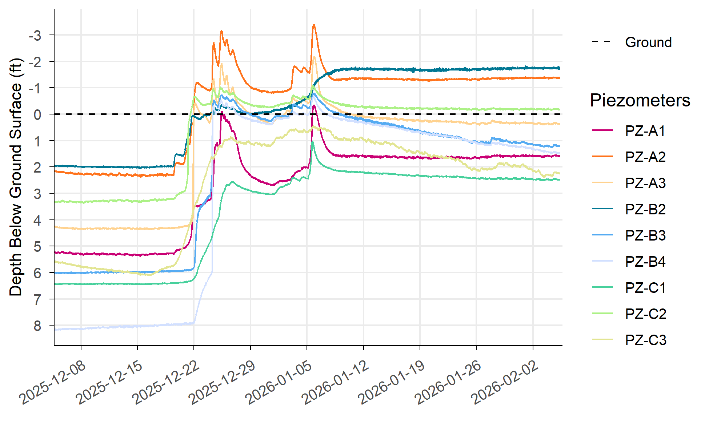<!-- -->

``` r
plt_gw_precip <-
  precip_data |>
  filter(site == "KPD") |>
  filter(timestamp >= GW_START) |>
  filter(timestamp <= GW_END) |>
  ggplot() +
  geom_hline(yintercept = 0) +
  geom_rect(aes(xmin = timestamp,
                xmax = timestamp + hours(1),
                ymin = 0,
                ymax = precip_in)) +
  scale_x_datetime(name = "",
                 date_breaks = "1 week",
                 expand = c(0, 0),
                 limits = c(GW_START, GW_END)) +
  scale_y_continuous(name = "Precipitation (in)",
                     breaks = scales::breaks_width(0.1),
                     expand = c(0, NA)) +
  theme(panel.grid.major = element_line(),
        axis.text.x.bottom = element_text(angle = 30, hjust=1))

print(plt_gw_precip)
```

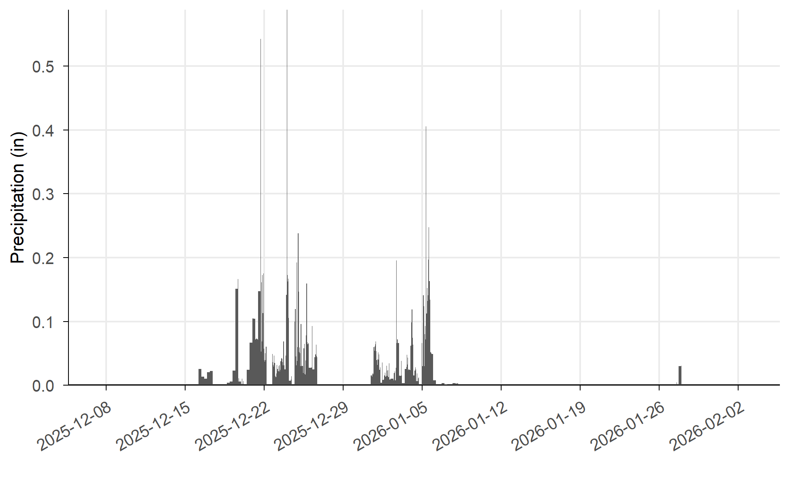<!-- -->

``` r
(plt_gw_precip / plt_gw_depth / plt_gw_elev) +
  plot_layout(heights = c(1, 2, 2), guides = "collect", axes = "collect_x")
```

    ## Warning: Removed 73 rows containing missing values or values outside the scale range
    ## (`geom_line()`).
    ## Removed 73 rows containing missing values or values outside the scale range
    ## (`geom_line()`).

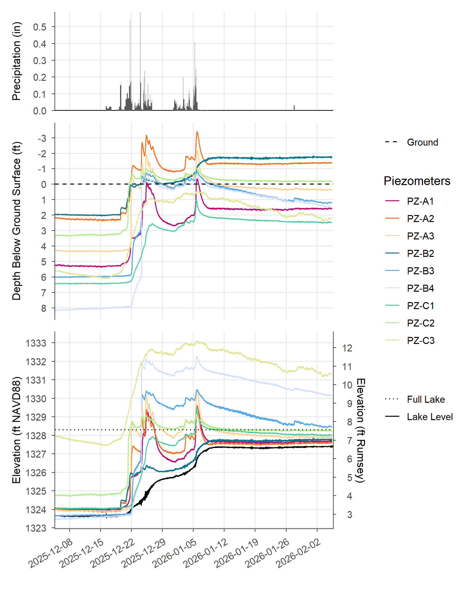<!-- -->

## 0.3 Surface Water

``` r
SW_START <- ymd_hms("2025-12-05T00:00:00")
SW_END <- ymd_hms("2026-06-15T23:59:59")
```

``` r
plt_sw_depth <-
  df_pivot |>
  filter(category == "Stage Gage") |>
  filter(timestamp >= SW_START) |>
  filter(timestamp <= SW_END) |>
  ggplot(aes(x = timestamp, y = depth)) +
  geom_line(aes(color = code)) +
  geom_hline(aes(yintercept = 0)) +
  scale_x_datetime(name = "",
                   date_breaks = "1 month",
                   expand = c(0, 0),
                   limits = c(SW_START, SW_END)) +
  scale_y_continuous(name = "Water Depth (ft)",
                     breaks = scales::breaks_width(1),
                     expand = c(0, NA)) +
  scale_color_manual(name = "Stage Gages",
                     values = site_colors) +
  theme(panel.grid.major = element_line(),
        axis.text.x.bottom = element_text(angle = 30, hjust=1))

print(plt_sw_depth)
```

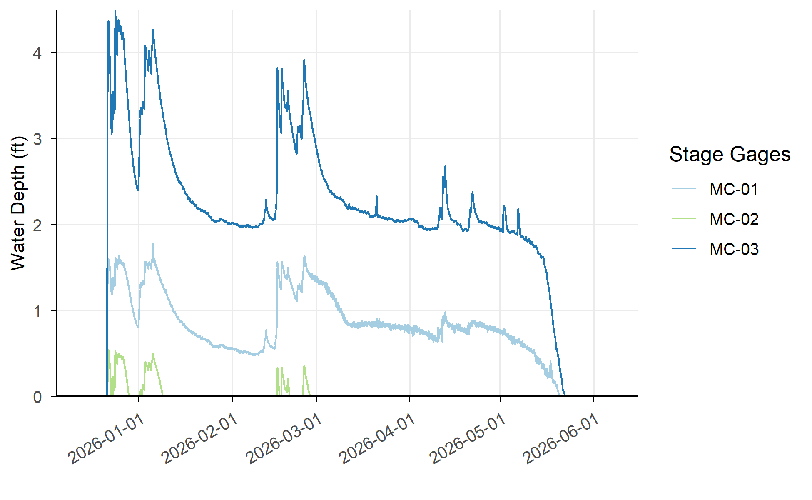<!-- -->

``` r
plt_sw_elev <-
  df_pivot |>
  filter(category == "Stage Gage") |>
  filter(timestamp >= SW_START) |>
  filter(timestamp <= SW_END) |>
  ggplot(aes(x = timestamp, y = wse_ft_navd88)) +
  geom_line(data = ll_data |> filter(timestamp < SW_END), 
            aes(y = value, linetype = "Lake Level")) +
  geom_line(aes(color = code)) +
  geom_hline(aes(yintercept = rumsey_to_navd88_usgs(7.56),
                 linetype = "Full Lake")) +
  scale_x_datetime(name = "",
                   date_breaks = "1 month",
                   expand = c(0, 0),
                   limits = c(SW_START, SW_END)) +
  scale_y_continuous(name = "Elevation (ft NAVD88)",
                     breaks = scales::breaks_width(1),
                     sec.axis = sec_axis(name = "Elevation (ft Rumsey)", 
                                         transform = ~ navd88_to_rumsey_usgs(.),
                                         breaks = scales::breaks_width(1))) +
  scale_color_manual(name = "Stage Gages",
                     values = site_colors) +
  scale_linetype_manual(name = "",
                        values = c("Lake Level" = "solid",
                                   "Full Lake" = "dotted")) +
  theme(panel.grid.major = element_line(),
        axis.text.x.bottom = element_text(angle = 30, hjust=1))

print(plt_sw_elev)
```

    ## Warning: Removed 20155 rows containing missing values or values outside the scale range
    ## (`geom_line()`).

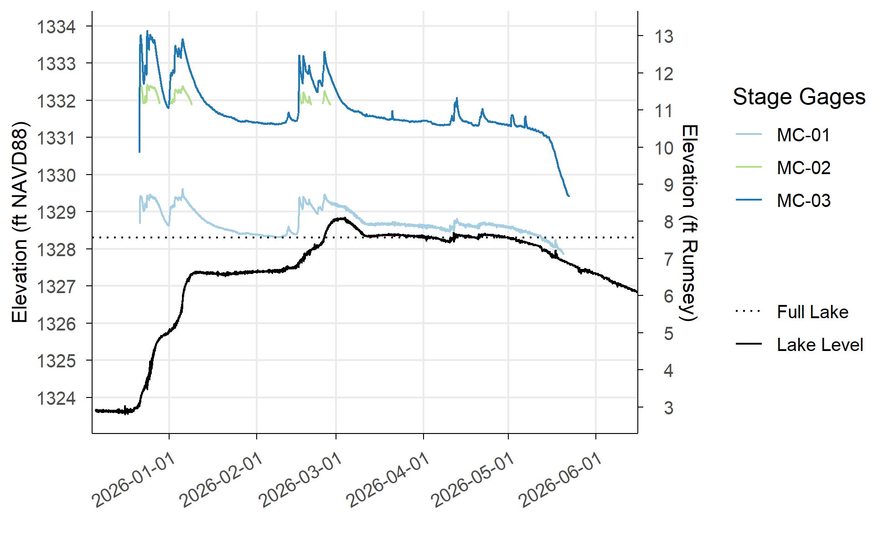<!-- -->

``` r
plt_sw_precip <-
  precip_data |>
  filter(site == "UMC") |>
  filter(timestamp >= SW_START) |>
  filter(timestamp <= SW_END) |>
  ggplot() +
  geom_hline(yintercept = 0) +
  geom_rect(aes(xmin = timestamp,
                xmax = timestamp + hours(1),
                ymin = 0,
                ymax = precip_in)) +
  scale_x_datetime(name = "",
                   date_breaks = "1 month",
                   expand = c(0, 0),
                   limits = c(SW_START, SW_END)) +
  scale_y_continuous(name = "Precipitation (in)",
                     breaks = scales::breaks_width(0.1),
                     expand = c(0, NA)) +
  theme(panel.grid.major = element_line(),
        axis.text.x.bottom = element_text(angle = 30, hjust=1))

print(plt_sw_precip)
```

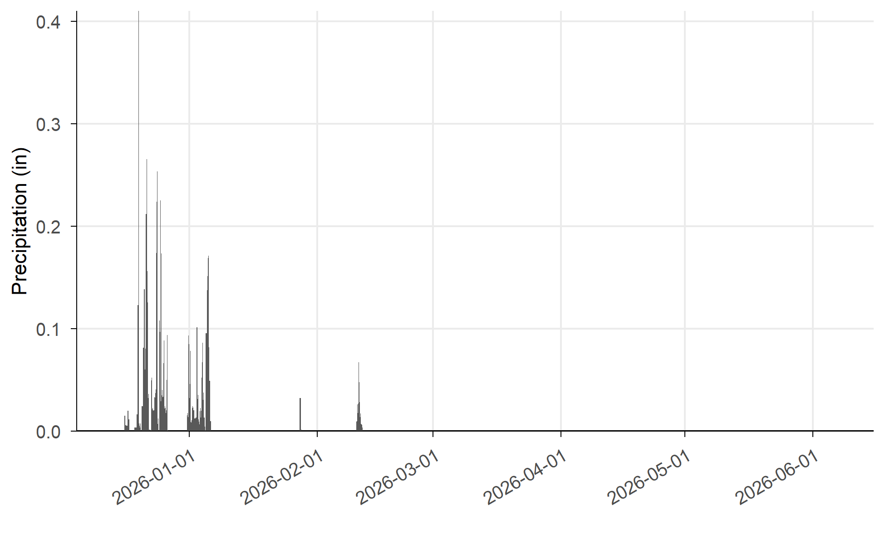<!-- -->

``` r
(plt_sw_precip / plt_sw_depth / plt_sw_elev) +
  plot_layout(heights = c(1, 2, 2), guides = "collect", axes = "collect_x")
```

    ## Warning: Removed 20155 rows containing missing values or values outside the scale range
    ## (`geom_line()`).

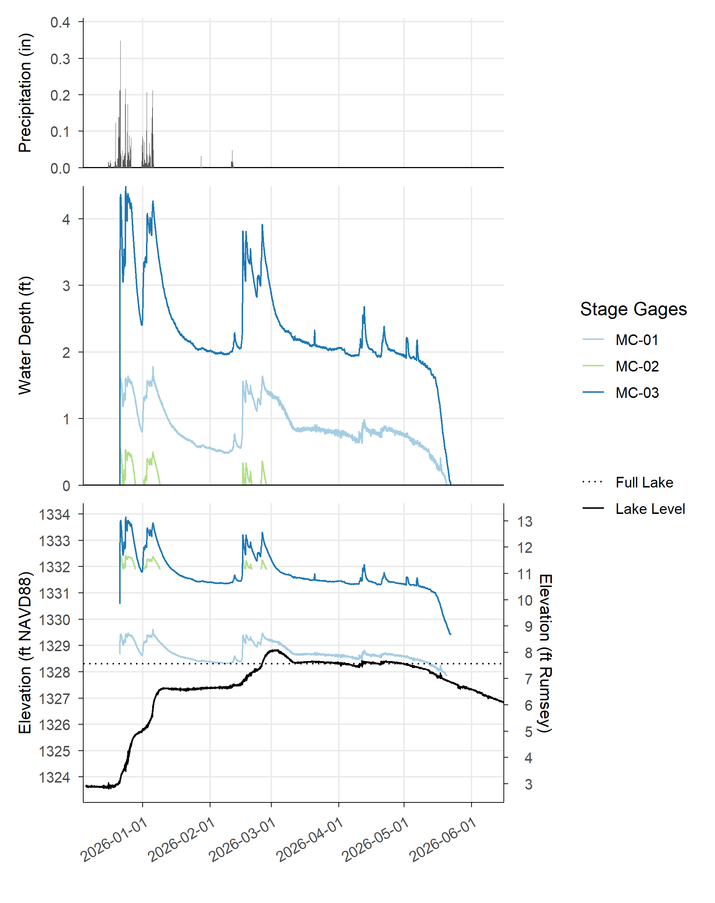<!-- -->

## 0.4 Specific Figures

``` r
plt_gw_depth_b4 <-
  df_pivot |>
  filter(category == "Piezometer") |>
  filter(code == "PZ-B4") |>
  filter(timestamp >= GW_START) |>
  filter(timestamp <= GW_END) |>
  ggplot(aes(x = timestamp, y = gw_depth_ft)) +
  geom_line(aes(color = code)) +
  geom_hline(aes(yintercept = 0,
                 linetype = "Ground")) +
  scale_x_datetime(name = "",
                   date_breaks = "1 week",
                   expand = c(0, 0),
                   limits = c(GW_START, GW_END)) +
  scale_y_reverse(name = "Depth Below Ground (ft)",
                  breaks = scales::breaks_width(1)) +
  scale_color_manual(name = "Piezometers",
                     values = "black") +
  scale_linetype_manual(name = "",
                        values = c("Ground" = "dashed")) +
  theme(panel.grid.major = element_line(),
        axis.text.x.bottom = element_text(angle = 30, hjust=1))

print((plt_gw_precip / plt_gw_depth_b4) +
        plot_layout(heights = c(1, 2),
                    axes = "collect_x"))
```

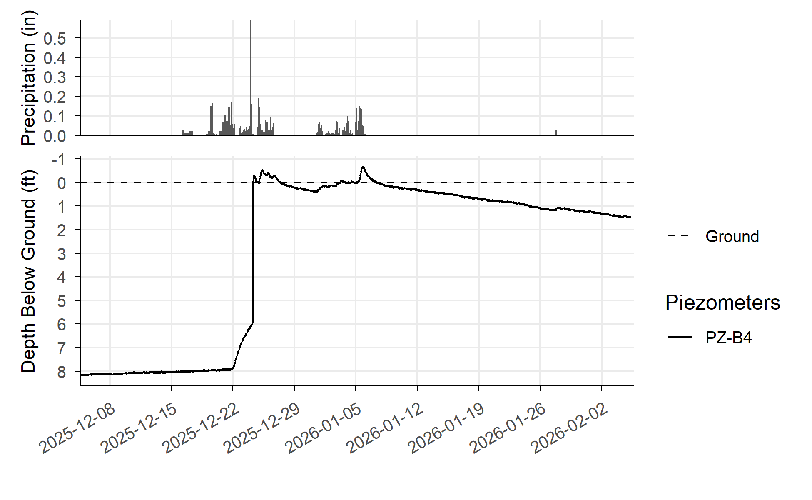<!-- -->

``` r
plt_gw_depth_a3 <-
  df_pivot |>
  filter(category == "Piezometer") |>
  filter(code == "PZ-A3") |>
  filter(timestamp >= GW_START) |>
  filter(timestamp <= GW_END) |>
  ggplot(aes(x = timestamp, y = gw_depth_ft)) +
  geom_line(aes(color = code)) +
  geom_hline(aes(yintercept = 0,
                 linetype = "Ground")) +
  scale_x_datetime(name = "",
                   date_breaks = "1 week",
                   expand = c(0, 0),
                   limits = c(GW_START, GW_END)) +
  scale_y_reverse(name = "Depth Below Ground (ft)",
                  breaks = scales::breaks_width(1)) +
  scale_color_manual(name = "Piezometers",
                     values = "black") +
  scale_linetype_manual(name = "",
                        values = c("Ground" = "dashed")) +
  theme(panel.grid.major = element_line(),
        axis.text.x.bottom = element_text(angle = 30, hjust=1))

print((plt_gw_precip / plt_gw_depth_a3) +
        plot_layout(heights = c(1, 2),
                    axes = "collect_x"))
```

    ## Warning: Removed 2 rows containing missing values or values outside the scale range
    ## (`geom_line()`).

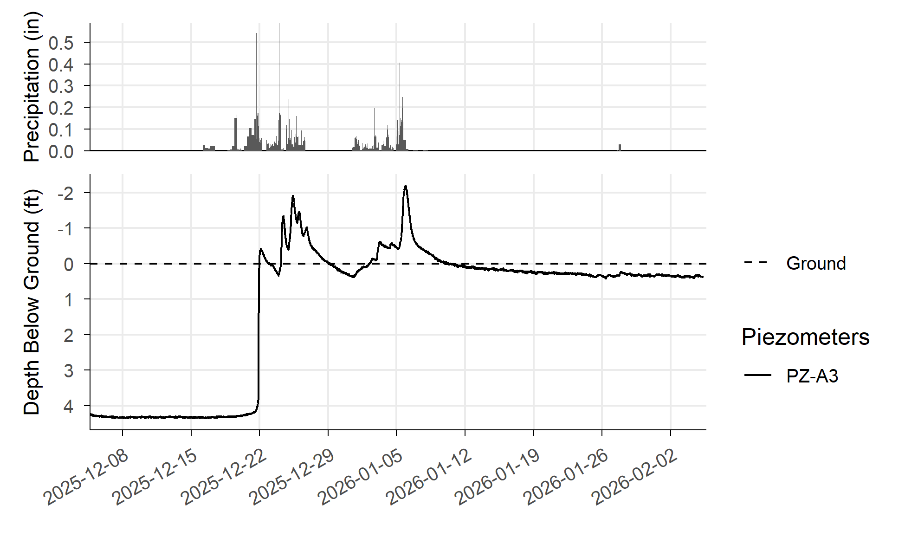<!-- -->

``` r
plt_gw_depth_a2_b2 <-
  df_pivot |>
  filter(category == "Piezometer") |>
  filter(code %in% c("PZ-A2", "PZ-B2")) |>
  filter(timestamp >= GW_START) |>
  filter(timestamp <= GW_END) |>
  ggplot(aes(x = timestamp, y = gw_depth_ft)) +
  geom_line(aes(color = code)) +
  geom_hline(aes(yintercept = 0,
                 linetype = "Ground")) +
  scale_x_datetime(name = "",
                   date_breaks = "1 week",
                   expand = c(0, 0),
                   limits = c(GW_START, GW_END)) +
  scale_y_reverse(name = "Depth Below Ground (ft)",
                  breaks = scales::breaks_width(1)) +
  scale_color_manual(name = "Piezometers",
                     values = piezo_colors) +
  scale_linetype_manual(name = "",
                        values = c("Ground" = "dashed")) +
  theme(panel.grid.major = element_line(),
        axis.text.x.bottom = element_text(angle = 30, hjust=1))

print((plt_gw_precip / plt_gw_depth_a2_b2) +
        plot_layout(heights = c(1, 2),
                    axes = "collect_x"))
```

    ## Warning: Removed 13 rows containing missing values or values outside the scale range
    ## (`geom_line()`).

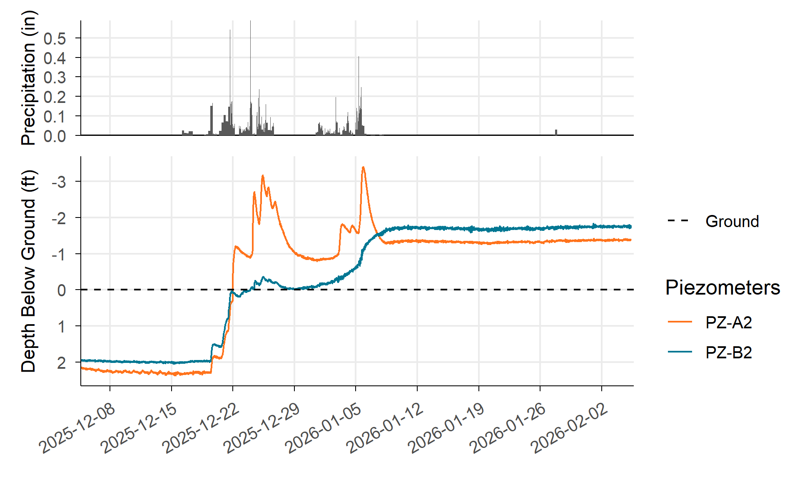<!-- -->

## 0.5 SW-GW Interaction

``` r
plt_sw_gw_elev <-
  df_pivot |>
  filter(code %in% c("MC-01", "PZ-C1")) |>
  filter(timestamp >= GW_START) |>
  filter(timestamp <= GW_END) |>
  ggplot(aes(x = timestamp, y = coalesce(wse_ft_navd88, gwe_ft_navd88))) +
  geom_line(data = ll_data |> filter(timestamp < GW_END), 
            aes(y = value, linetype = "Lake Level")) +
  geom_line(aes(color = code)) +
  geom_hline(aes(yintercept = rumsey_to_navd88_usgs(7.56),
                 linetype = "Full Lake")) +
  scale_x_datetime(name = "",
                   date_breaks = "1 week",
                   expand = c(0, 0),
                   limits = c(GW_START, GW_END)) +
  scale_y_continuous(name = "Elevation (ft NAVD88)",
                     breaks = scales::breaks_width(1),
                     sec.axis = sec_axis(name = "Elevation (ft Rumsey)", 
                                         transform = ~ navd88_to_rumsey_usgs(.),
                                         breaks = scales::breaks_width(1))) +
  scale_color_manual(name = "Stations",
                     values = c(site_colors, piezo_colors)) +
  scale_linetype_manual(name = "",
                        values = c("Lake Level" = "solid",
                                   "Full Lake" = "dotted")) +
  theme(panel.grid.major = element_line(),
        axis.text.x.bottom = element_text(angle = 30, hjust=1))

print(plt_sw_gw_elev)
```

    ## Warning: Removed 1636 rows containing missing values or values outside the scale range
    ## (`geom_line()`).

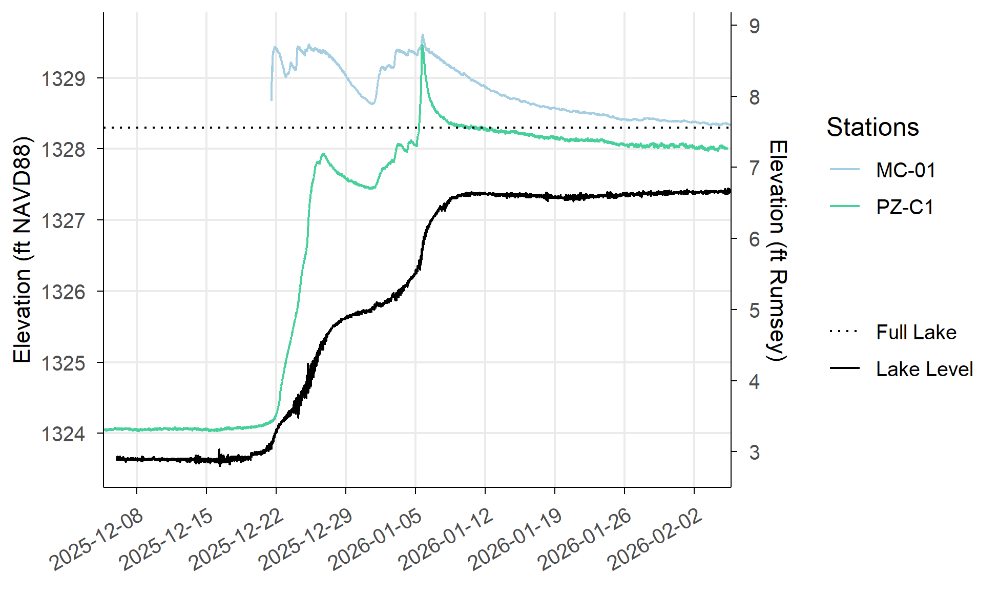<!-- -->
