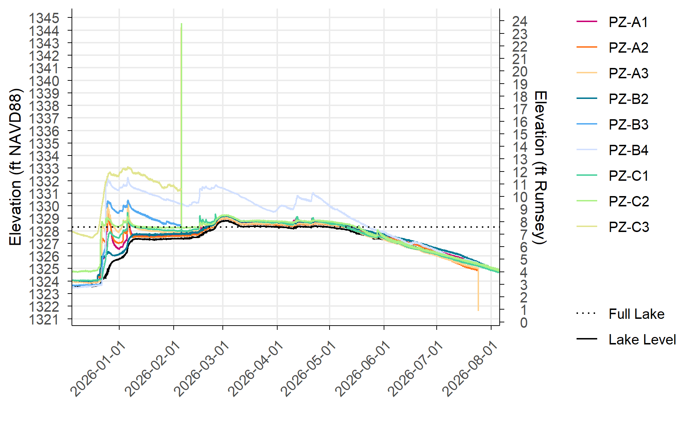
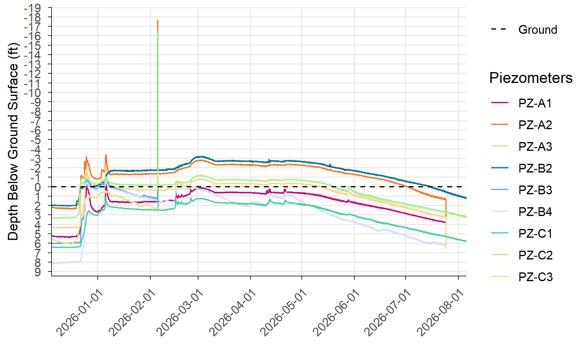
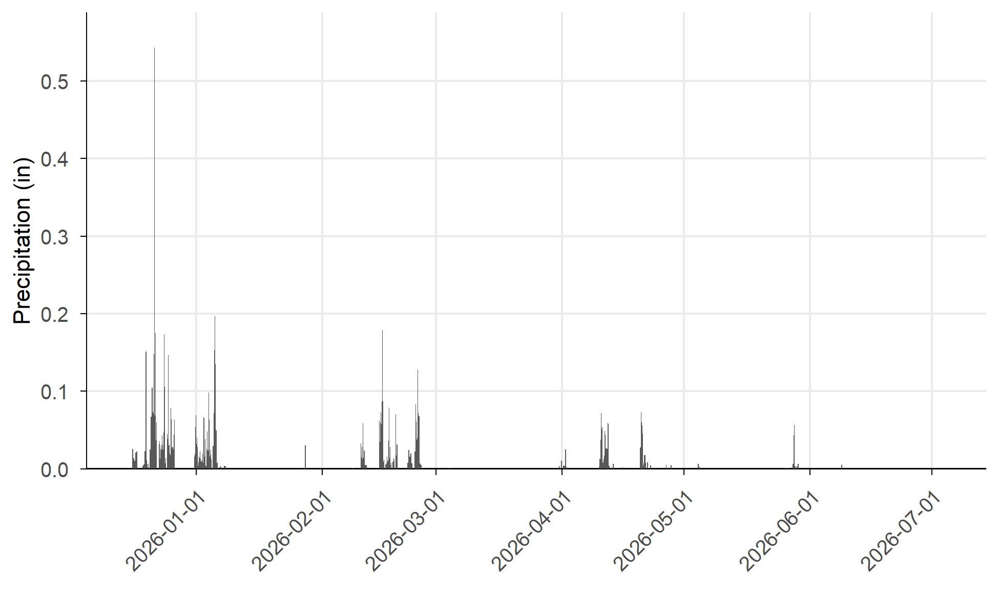
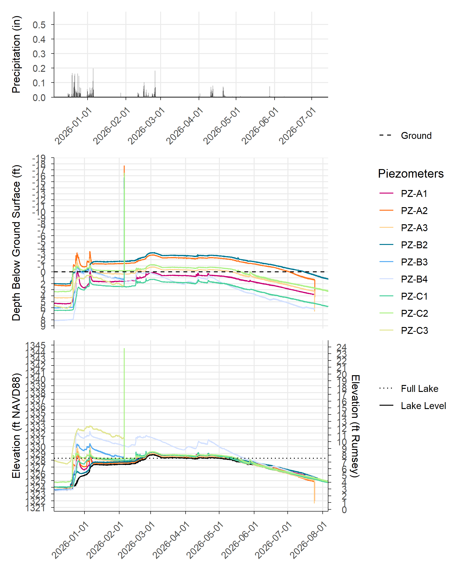
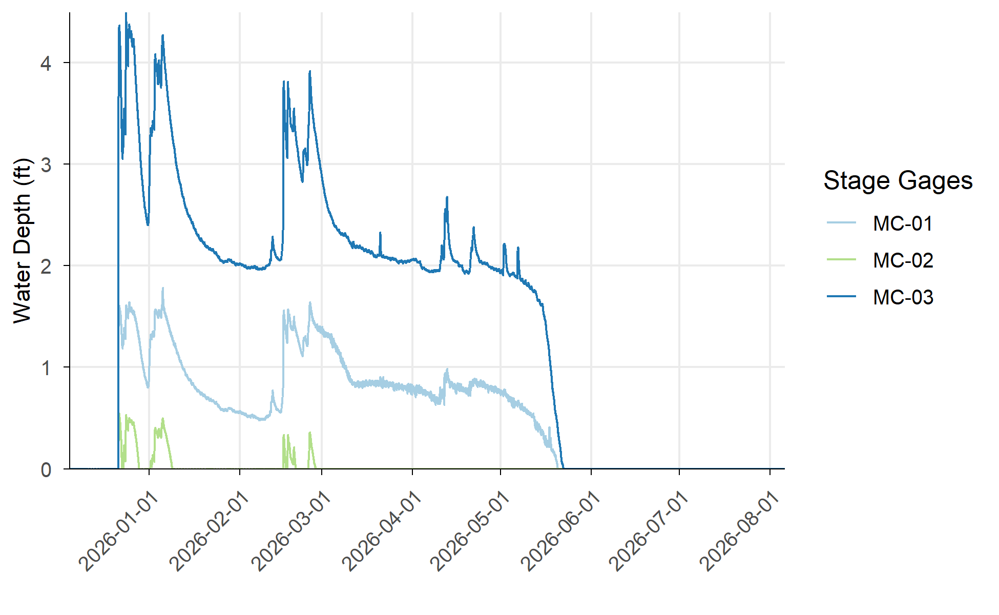
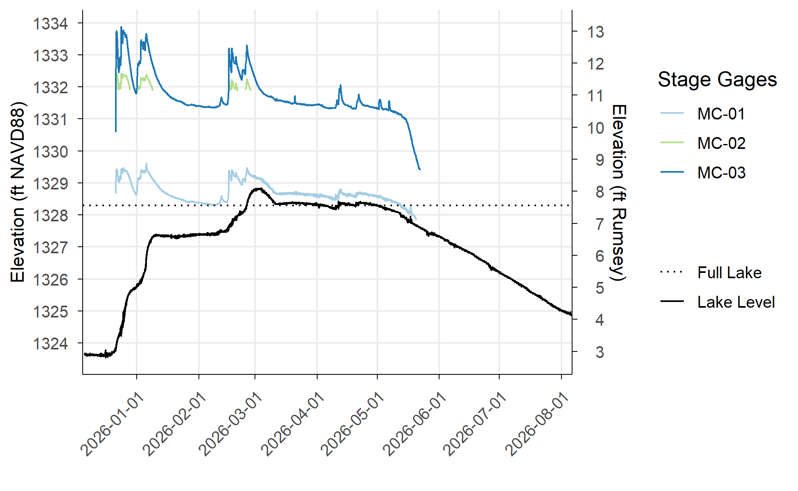
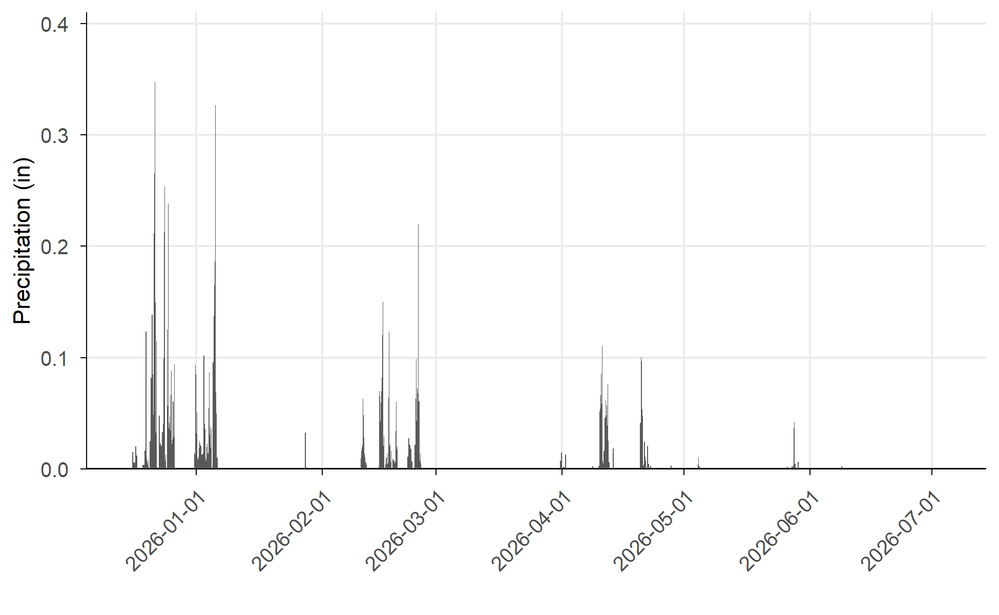
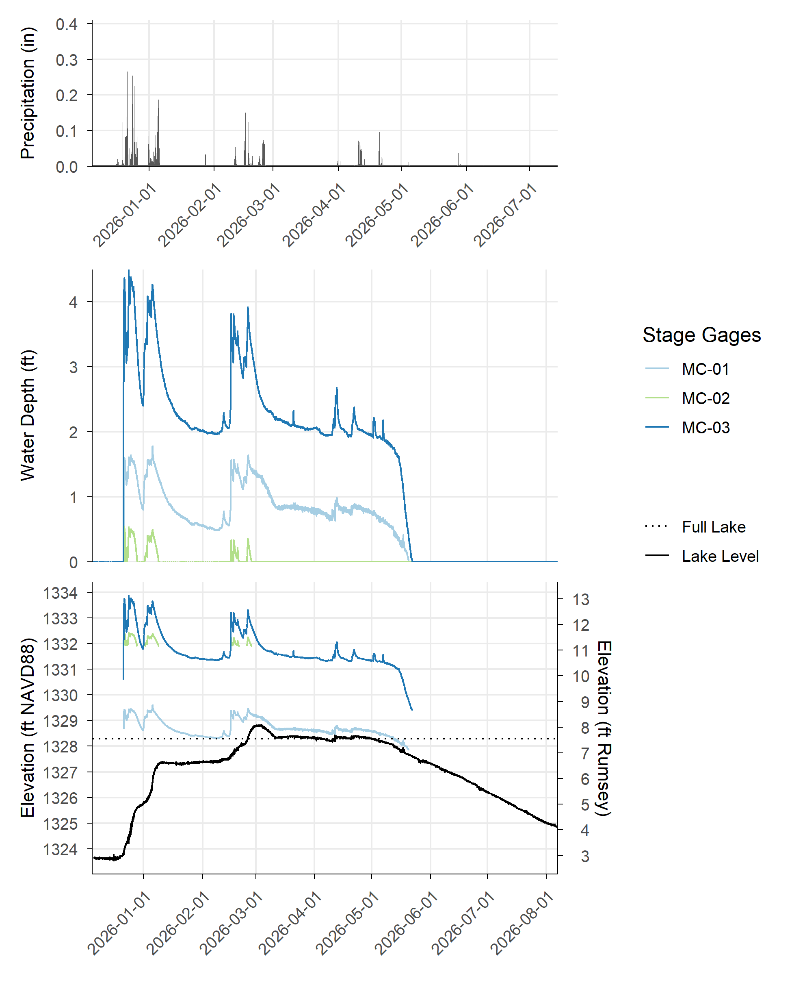

Kuhlanapo Gage Data Figures for Reports
================
Skyler Lewis
2026-08-07

- [0.1 Import Data](#01-import-data)
- [0.2 Groundwater Study](#02-groundwater-study)
- [0.3 Surface Water](#03-surface-water)

``` r
knitr::opts_chunk$set(
    fig.height = 4,
    fig.width = 6.5,
    message = FALSE,
    warning = TRUE,
    dpi = 300
)
library(tidyverse)
library(janitor)
library(patchwork)

theme_custom <- function(base_size = 12) {
  theme_minimal(base_size = base_size) +
    theme(
      panel.grid.major = element_blank(),
      panel.grid.minor = element_blank(),
      axis.line = element_line(color = "black", linewidth = 0.3),
      axis.ticks = element_line(color = "black", linewidth = 0.3),
      axis.title = element_text(size = rel(0.9)),
      plot.title.position = "plot"
    )
}
theme_set(theme_custom())

source(here::here("global.R"))

# As published on USGS lake level gage 11450000
navd88_to_rumsey_usgs <- function(x) x - 1320.74
rumsey_to_navd88_usgs <- function(x) x + 1320.74
```

## 0.1 Import Data

Import time series data

``` r
ts_data <-  readRDS(here::here("data", "gage_data.Rds")) 
ll_data <- readRDS(here::here("data/usgs_lake_level_11450000.rds"))
precip_data <- readRDS(here::here("data/precip_ts.rds"))
```

Apply data cleaning via `build_df_pivot()` (defined in `global.R`),
shared with `app.R` so the two can never drift out of sync.

``` r
df_pivot <- build_df_pivot(ts_data, ll_data)
```

## 0.2 Groundwater Study

``` r
plt_gw_elev <-
  df_pivot |>
  filter(category == "Piezometer") |>
  filter(timestamp >= ymd("2025-12-05")) |>
  filter(timestamp < Sys.Date()) |>
  ggplot(aes(x = timestamp, y = gwe_ft_navd88)) +
  geom_line(data = ll_data |> filter(timestamp < Sys.Date()),
            aes(y = value, linetype = "Lake Level")) +
  geom_line(aes(color = code)) +
  geom_hline(aes(yintercept = rumsey_to_navd88_usgs(7.56),
                 linetype = "Full Lake")) +
  scale_x_datetime(name = "",
                   date_breaks = "1 month",
                   expand = c(0, 0)) +
  scale_y_continuous(name = "Elevation (ft NAVD88)",
                     breaks = scales::breaks_width(1),
                     sec.axis = sec_axis(name = "Elevation (ft Rumsey)", 
                                         transform = ~ navd88_to_rumsey_usgs(.),
                                         breaks = scales::breaks_width(1))) +
  scale_color_manual(name = "Piezometers",
                     values = piezo_colors) +
  scale_linetype_manual(name = "",
                        values = c("Lake Level" = "solid",
                                   "Full Lake" = "dotted")) +
  theme(panel.grid.major = element_line(),
        axis.text.x.bottom = element_text(angle = 45, hjust=1))

print(plt_gw_elev)
```

    ## Warning: Removed 56 rows containing missing values or values outside the scale range
    ## (`geom_line()`).

<!-- -->

``` r
plt_gw_depth <-
  df_pivot |>
  filter(category == "Piezometer") |>
  filter(timestamp >= ymd("2025-12-05")) |>
  filter(timestamp < Sys.Date()) |>
  ggplot(aes(x = timestamp, y = gw_depth_ft)) +
  geom_line(aes(color = code)) +
  geom_hline(aes(yintercept = 0,
                 linetype = "Ground")) +
  scale_x_datetime(name = "",
                   date_breaks = "1 month",
                   expand = c(0, 0)) +
  scale_y_reverse(name = "Depth Below Ground Surface (ft)",
                  breaks = scales::breaks_width(1)) +
  scale_color_manual(name = "Piezometers",
                     values = piezo_colors) +
  scale_linetype_manual(name = "",
                        values = c("Ground" = "dashed")) +
  theme(panel.grid.major = element_line(),
        axis.text.x.bottom = element_text(angle = 45, hjust=1))

print(plt_gw_depth)
```

    ## Warning: Removed 56 rows containing missing values or values outside the scale range
    ## (`geom_line()`).

<!-- -->

``` r
plt_gw_precip <-
  precip_data |>
  filter(site == "KPD") |>
  filter(timestamp >= ymd("2025-12-05")) |>
  filter(timestamp < Sys.Date()) |>
  ggplot() +
  geom_hline(yintercept = 0) +
  geom_rect(aes(xmin = timestamp,
                xmax = timestamp + hours(1),
                ymin = 0,
                ymax = precip_in)) +
  scale_x_datetime(name = "",
                 date_breaks = "1 month",
                 expand = c(0, 0)) +
  scale_y_continuous(name = "Precipitation (in)",
                     breaks = scales::breaks_width(0.1),
                     expand = c(0, NA)) +
  theme(panel.grid.major = element_line(),
        axis.text.x.bottom = element_text(angle = 45, hjust=1))

print(plt_gw_precip)
```

<!-- -->

``` r
(plt_gw_precip / plt_gw_depth / plt_gw_elev) +
  plot_layout(heights = c(1, 2, 2), guides = "collect", axes = "collect_x")
```

    ## Warning: Removed 56 rows containing missing values or values outside the scale range
    ## (`geom_line()`).
    ## Removed 56 rows containing missing values or values outside the scale range
    ## (`geom_line()`).

<!-- -->

## 0.3 Surface Water

``` r
plt_sw_depth <-
  df_pivot |>
  filter(category == "Stage Gage") |>
  filter(timestamp >= ymd("2025-12-05")) |>
  filter(timestamp < Sys.Date()) |>
  ggplot(aes(x = timestamp, y = depth)) +
  geom_line(aes(color = code)) +
  scale_x_datetime(name = "",
                   date_breaks = "1 month",
                   expand = c(0, 0)) +
  scale_y_continuous(name = "Water Depth (ft)",
                     breaks = scales::breaks_width(1),
                     expand = c(0, NA)) +
  scale_color_manual(name = "Stage Gages",
                     values = site_colors) +
  theme(panel.grid.major = element_line(),
        axis.text.x.bottom = element_text(angle = 45, hjust=1))

print(plt_sw_depth)
```

    ## Warning: Removed 37 rows containing missing values or values outside the scale range
    ## (`geom_line()`).

<!-- -->

``` r
plt_sw_elev <-
  df_pivot |>
  filter(category == "Stage Gage") |>
  filter(timestamp >= ymd("2025-12-05")) |>
  filter(timestamp < Sys.Date()) |>
  ggplot(aes(x = timestamp, y = wse_ft_navd88)) +
  geom_line(data = ll_data |> filter(timestamp < Sys.Date()),
            aes(y = value, linetype = "Lake Level")) +
  geom_line(aes(color = code)) +
  geom_hline(aes(yintercept = rumsey_to_navd88_usgs(7.56),
                 linetype = "Full Lake")) +
  scale_x_datetime(name = "",
                   date_breaks = "1 month",
                   expand = c(0, 0)) +
  scale_y_continuous(name = "Elevation (ft NAVD88)",
                     breaks = scales::breaks_width(1),
                     sec.axis = sec_axis(name = "Elevation (ft Rumsey)", 
                                         transform = ~ navd88_to_rumsey_usgs(.),
                                         breaks = scales::breaks_width(1))) +
  scale_color_manual(name = "Stage Gages",
                     values = site_colors) +
  scale_linetype_manual(name = "",
                        values = c("Lake Level" = "solid",
                                   "Full Lake" = "dotted")) +
  theme(panel.grid.major = element_line(),
        axis.text.x.bottom = element_text(angle = 45, hjust=1))

print(plt_sw_elev)
```

    ## Warning: Removed 34934 rows containing missing values or values outside the scale range
    ## (`geom_line()`).

<!-- -->

``` r
plt_sw_precip <-
  precip_data |>
  filter(site == "UMC") |>
  filter(timestamp >= ymd("2025-12-05")) |>
  filter(timestamp < Sys.Date()) |>
  ggplot() +
  geom_hline(yintercept = 0) +
  geom_rect(aes(xmin = timestamp,
                xmax = timestamp + hours(1),
                ymin = 0,
                ymax = precip_in)) +
  scale_x_datetime(name = "",
                   date_breaks = "1 month",
                   expand = c(0, 0)) +
  scale_y_continuous(name = "Precipitation (in)",
                     breaks = scales::breaks_width(0.1),
                     expand = c(0, NA)) +
  theme(panel.grid.major = element_line(),
        axis.text.x.bottom = element_text(angle = 45, hjust=1))

print(plt_sw_precip)
```

<!-- -->

``` r
(plt_sw_precip / plt_sw_depth / plt_sw_elev) +
  plot_layout(heights = c(1, 2, 2), guides = "collect", axes = "collect_x")
```

    ## Warning: Removed 37 rows containing missing values or values outside the scale range
    ## (`geom_line()`).

    ## Warning: Removed 34934 rows containing missing values or values outside the scale range
    ## (`geom_line()`).

<!-- -->
